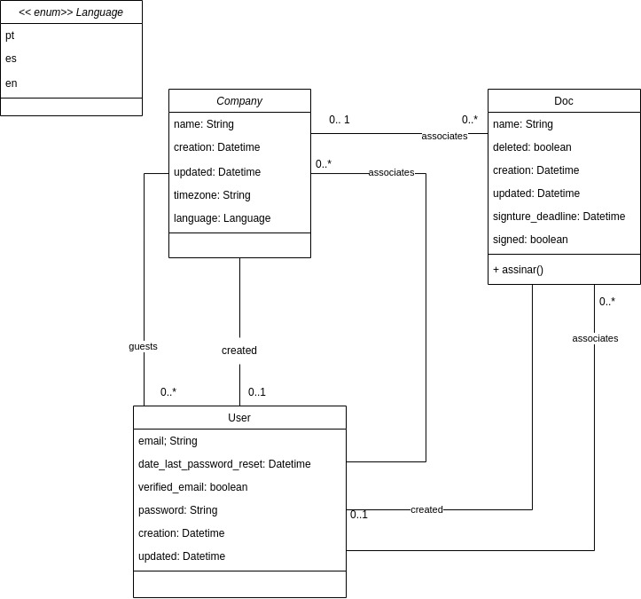

# Desafio ZapSign

<!-- TOC -->

- [Desafio ZapSign](#desafio-zapsign)
- [Especificação](#especificação)
- [Diagrama de classes](#diagrama-de-classes)
- [Configuração do ambiente de desenvolvimento](#configuração-do-ambiente-de-desenvolvimento)
  - [Banco de dados (PostgreSQL)](#banco-de-dados-postgresql)
  - [Backend](#backend)
  - [Frontend](#frontend)
- [Conceitos](#conceitos)
  - [Django](#django)
  - [Angular](#angular)
- [Referências](#referências)
  - [Docker e DockerCompose](#docker-e-dockercompose)
    - [Compilando as imagens Docker do desafio](#compilando-as-imagens-docker-do-desafio)
- [Desenvolvedora](#desenvolvedora)
- [Licença de uso](#licença-de-uso)
 
<!-- TOC -->

# Especificação

Transformar os critérios de aceite abaixo em *User Stories* e executar cada um dos
*User Stories* propostos:

* A linguagem no *backend* deve ser [Python](https://www.python.org) e o framework deve ser [Django](https://www.djangoproject.com) (qualquer versão);
* A linguagem no frontend deve ser [Javascript](https://developer.mozilla.org/pt-BR/docs/Web/JavaScript) o framework deve ser [Angular](https://angular.io) (qualquer
versão);
* O design não será avaliado (pode utilizar qualquer bootstrap/material UI da vida).

**Uma Company deve ter:**

* nome (``String`` limite de 255 caracteres);
* data de criação (``Datetime``);
* data da última atualização (``Datetime``);
* fuso horário (``String`` limite de 50 caracteres);
* linguagem (opções: ``pt``, ``es`` ou ``en``);
* usuários convidados;
* usuário que criou;
* documentos associados.

O nome é **obrigatório**.<br>
A data de criação é **obrigatória**.<br>
O valor padrão para fuso horário é: **"-03:00"**.<br>
O valor padrão para linguagem é **"pt"**.<br>

**Um Doc deve ter:**

* nome (``String`` limite de 255 caracteres);
* deletado (``boolean``);
* data de criação (``Datetime``);
* data da última atualização (``Datetime``);
* data limite para assinar (``Datetime``);
* assinado (``boolean``);
* company associada;
* usuário que criou o documento.

O nome é **obrigatório**.<br>
A campo deletado por padrão é **falso**.<br>
A data de criação é **obrigatória**.<br>
Toda vez que houver uma atualização em qualquer campo do ``Doc``, o campo data da última
atualização deve ser atualizado também.<br>
O campo assinado é **falso** por padrão.<br>
Na interface deve haver um botão escrito **"assinar"** que altera o status do campo para
**verdadeiro**.<br>
Caso o status do campo assinado seja **verdadeiro**, o botão deve estar **desativado**.<br>
Após definido como **verdadeiro**, o campo assinado deve ser **imutável**.<br>

**Um User tem:**

* email (``String`` limite de 255 caracteres);
* data da última redefinição de senha (``Datetime``);
* email verificado (``boolean``);
* senha (``String`` limite de 255 caracteres);
* data de criação (``Datetime``);
* data da última atualização (``Datetime``);
* companhias associadas;
* companhia original;
* documentos associados.

O email é **obrigatório**.<br>
O campo email verificado por padrão é **false**.<br>
O campo senha é **obrigatório** e deve ser maior ou igual a 6 caracteres.<br>
O campo data de criação é **obrigatório**.<br>
Toda vez que houver uma atualização em qualquer campo do usuário, o campo data da última atualização deve ser atualizado também.<br>
Tudo deve ser escrito com testes automatizados.<br>

# Diagrama de classes



# Configuração do ambiente de desenvolvimento

## Banco de dados (PostgreSQL)

No Ubuntu 22.04 64 bits, instale o PostgreSQL 14 com o seguinte comando:

```bash
sudo apt install postgresql postgresql-contrib -y
```

> Por padrão, a aplicação fará uso do usuário ``postgres`` com a senha ``postgres``, no endereço ``localhost`` na porta ``5432``. Essas e outras configurações podem ser alterados no arquivo [backend/front/settings.py](backend/front/settings.py), mais especificamente na constante ``DATABASES``.

Crie o banco de dados ``djangodb``.

```bash
sudo -u postgres createdb djangodb
```

## Backend

No Ubuntu 22.04 64 bits, instale o Python 3.11 com os seguintes comandos:

```bash
sudo apt install python3.11 -y
sudo ln -s /usr/bin/python3 /usr/bin/python
sudo ln -s /usr/bin/python3 /usr/bin/python3
```

Instale o ``venv``, para ser usado na criação de ambientes virtuais com o Python. Execute o seguinte comando:

```bash
sudo apt install python3-venv -y
```

Crie um ambiente virtual no projeto com os seguintes comandos:

```bash
mkdir -p desafiozap/venv
cd desafiozap
python3 -m venv venv
```

Ative o ambiente virtual com o seguinte comando:

```bash
cd desafiozap/
source venv/bin/activate
```

Instale o Django dentro do ambiente virtual, com os seguintes comandos:

```bash
pip install django
pip install djangorestframework
pip install django-cors-headers
pip install psycopg2
pip install psycopg2-binary
```

Crie os arquivos de configuração do Django.

```bash
django-admin startproject front .
```

O comando a seguir realiza a configuração do banco de dados no arquivo ``settings.py`` e cria a estrutura base do banco de dados:

```bash
python3 manage.py makemigrations
python3 manage.py migrate
```

Crie o usuário administrador do Django:

```bash
python3 manage.py createsuperuser
```
Exemplo:

* Usuário: **admin**
* Senha: **admin**

Inicialize o Django. 

```bash
python manage.py runserver
```

O Django ficará acessível em: http://127.0.0.1:8000/admin

Crie o app ou módulos dentro da aplicação. Cada app é responsável por uma parte do sistema.

```bash
python manage.py startapp core
```

## Frontend

Execute os seguintes comandos para o ``nvm`` e o ``node``.

```bash
curl -o- https://raw.githubusercontent.com/nvm-sh/nvm/v0.39.7/install.sh | bash

source .bashrc

nvm install node
```

Instale o Angular com os seguintes comandos:

```bash
npm install -g @angular/cli

ng new frontend

cd frontend

ng serve
```

O frontend ficará acessível em: http://127.0.0.1:4200

# Conceitos

## Django

Django é um framework web Python de alto nível que permite o rápido desenvolvimento de sites seguros e de fácil manutenção. Construido por desenvolvedores experientes, o Django cuida de grande parte do trabalho de desenvolvimento web, para que você possa se concentrar em escrever seu aplicativo sem precisar reinventar a roda. É gratuito e de código aberto, tem uma comunidade próspera e ativa, ótima documentação e muitas opções de suporte gratuito e pago.

**Apesar de ser uma liguagem fullstack quando trabalhamos com Django é interessante usar uma liguagem de front como Angular, que além de mais especializada no frontend garante um desacoplamento entre back e front.**


## Angular

Angular é um popular framework de código aberto desenvolvido pelo Google para a criação de aplicativos da web dinâmicos e interativos.

Ele se baseia em TypeScript, uma linguagem superset do JavaScript, e utiliza uma abordagem orientada a componentes para a construção de interfaces. 

**Grande vantagem de usar o Angular é que gera Apps Sigle Page: para cada chamada ao servidor não precisa carregar a página inteira (apenas a primeira vez).**


# Referências

* **Curso Udemy**: https://www.udemy.com/course/aplicacao-web-django-angular-framework/
* Django request workflow: https://nthb.github.io/django/
* Django resquest framework: https://www.django-rest-framework.org/tutorial/quickstart/ 
* PostgreSQL: https://www.digitalocean.com/community/tutorials/how-to-install-postgresql-on-ubuntu-22-04-quickstart

**Links de apoio:**

* https://github.com/charan-sai-v/django_angular_crud_operations_with_postgresql/tree/main/frontend/src/app
* https://github.com/adamchainz/django-cors-headers
* https://material.angular.io/guide/getting-started
* https://github.com/Gpzim98/
* https://www.udemy.com/course/aplicacao-web-django-angular-framework/l

## Docker e DockerCompose

Instale o Docker no Ubuntu 22.04 64 bits com as instruções da seguinte página:  https://docs.docker.com/engine/install/ubuntu/

Inicie o serviço Docker com os seguintes comandos: 

```bash
# Start the Docker service
sudo systemctl start docker

# Configure Docker to boot up with the OS
sudo systemctl enable docker

# Add your user to the Docker group
sudo usermod -aG docker $USER
sudo setfacl -m user:$USER:rw /var/run/docker.sock
```

Instale o Docker Compose com os seguintes comandos: 

```bash
sudo su

COMPOSE_VERSION=1.29.2

sudo curl -L "https://github.com/docker/compose/releases/download/$COMPOSE_VERSION/docker-compose-$(uname -s)-$(uname -m)" -o /usr/local/bin/docker-compose

chmod +x /usr/local/bin/docker-compose

/usr/local/bin/docker-compose version

exit
```

Execute os containers Docker do desafio com os seguintes comandos:

```bash
cd desafiozap

docker-compose up
```

O backend (Django) ficará acessível em: http://127.0.0.1:8000/admin
* Usuário: **admin**
* Senha: **admin**

O frontend ficará acessível em: http://127.0.0.1:4200

Pare os containers Docker do desafio com os seguintes comandos:

```bash
cd desafiozap

docker-compose down
```

### Compilando as imagens Docker do desafio

Compile a imagem Docker do backend com o seguinte comando:

```bash
VERSION='1.0.0'

cd desafiozap

docker image build -t jmilitao/desafiozap_backend:$VERSION -f Dockerfile_backend .
```

Compile a imagem Docker do frontend com o seguinte comando:

```bash
VERSION='1.0.0'

cd desafiozap

docker image build -t jmilitao/desafiozap_frontend:$VERSION -f Dockerfile_frontend .
```

# Desenvolvedora

Janaina Militão do Nascimento

# Licença de uso

[GPLv3.0 2024](LICENSE)
